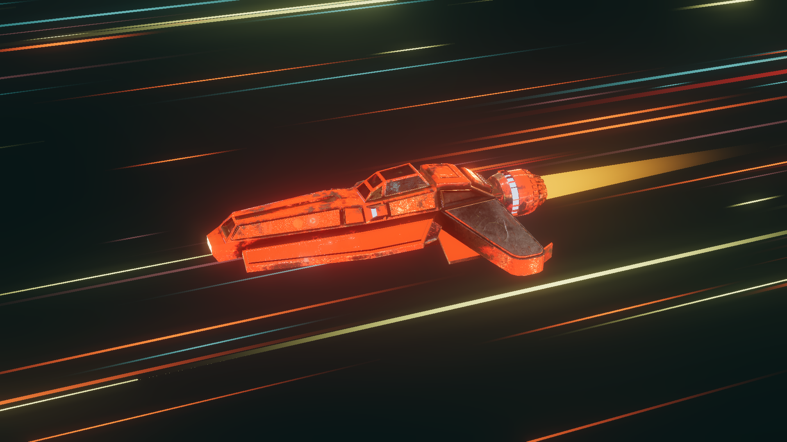

# Threlte Spaceship App

This project is a Svelte app built with Threlte and Three.js, allowing users to interact with a 3D spaceship that reacts to mouse movements. It incorporates cool effects like stars and an interactive spaceship model.

## [Demo](numbersanalyst.github.io/spaceship/)



## Features

- 3D spaceship model that reacts to mouse movements.
- Cool visual effects like stars in the background.
- Smooth user interaction with the spaceship.

## Getting Started

To get a local copy up and running follow these simple steps.

### Prerequisites

Make sure you have Node.js and npm installed on your machine.

### Installation

1. Clone the repo
   ```sh
   git clone https://github.com/numbersanalyst/spaceship.git
   ```
2. Install NPM packages
   ```sh
   npm install
   ```
3. Start the development server
   ```sh
   npm run dev
   ```

## Usage

- Move your mouse to interact with the spaceship.
- Enjoy the immersive experience with the 3D model and visual effects.

## Credits

This project was inspired by the tutorial [animating a spaceship](https://threlte.xyz/docs/examples/tutorials/animating-a-spaceship) by [Domenicobrz](https://github.com/Domenicobrz) from official Threlte documentation.

## License

Distributed under the MIT License. See `LICENSE` for more information.
